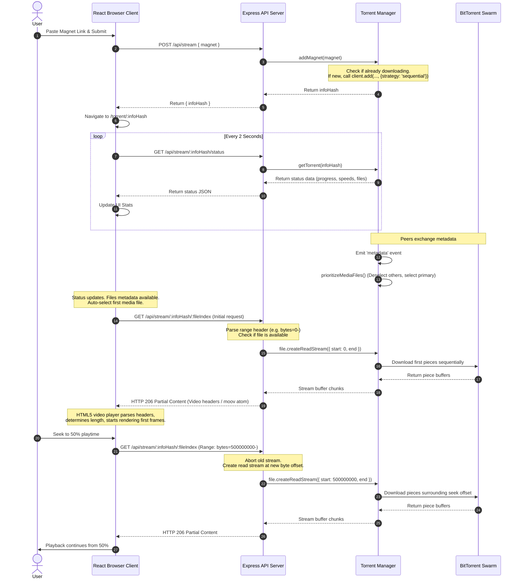

# How Real-Time Torrent Streaming Works

This document provides a detailed technical analysis of how the real-time torrent streaming engine is designed, implemented, and executed across the backend and frontend of this repository.

---

## 1. High-Level Architecture & Stream Flow

The application is structured as a local-first web app consisting of a **React + Vite Frontend** and an **Express Backend**. The browser cannot participate in the peer-to-peer BitTorrent network directly due to browser sandboxing and protocol differences. Instead, a Node.js backend handles peer connections, files, and piece downloading, serving the data to the browser over standard HTTP range requests.

```
┌─────────────────────────────────┐
│     Browser (React Client)      │
│  ┌───────────────────────────┐  │
│  │   HTML5 Video/Audio Tag   │  │
│  └─────────────┬─────────────┘  │
└────────────────┼────────────────┘
                 │
                 │ HTTP Range Requests (206 Partial Content)
                 ▼
┌─────────────────────────────────┐
│         Express Server          │
│  ┌───────────────────────────┐  │
│  │  stream.js Router Route   │  │
│  └─────────────┬─────────────┘  │
│                │ file.createReadStream({ start, end })
│                ▼
│  ┌───────────────────────────┐  │
│  │     torrent-manager.js    │  │
│  │    (webtorrent-hybrid)    │  │
│  └─────────────┬─────────────┘  │
└────────────────┼────────────────┘
                 │
                 │ BitTorrent Protocol (TCP/UDP/uTP/WebRTC)
                 ▼
┌─────────────────────────────────┐
│        BitTorrent Swarm         │
│         (Active Peers)          │
└─────────────────────────────────┘
```

---

## 2. Core Backend Streaming Mechanisms

The backend is powered by `webtorrent-hybrid` (encapsulated in [torrent-manager.js](file:///v:/temp/stream-torrent/server/torrent-manager.js)), which manages the lifecycle of torrent files and handles downloading, prioritization, and caching of data.

There are three key backend mechanisms that make real-time playback possible:

### A. Sequential Download Strategy
Standard BitTorrent clients download file pieces using a **rarest-first** strategy to maximize swarm health. However, for real-time video/audio playback, this strategy is unusable because media players need the beginning of the file first.
* In [torrent-manager.js:L99](file:///v:/temp/stream-torrent/server/torrent-manager.js#L99), webtorrent is initialized with the `sequential` strategy:
  ```javascript
  const torrent = this.client.add(input, { strategy: 'sequential' });
  ```
* This tells the BitTorrent engine to prioritize downloading pieces starting from index `0` up to the end of the file in sequential order.

### B. Media File Selection & Prioritization
Many torrents contain multiple files (e.g., subtitles, images, nfo files, or multiple video files). If WebTorrent attempts to download all files, it wastes bandwidth and delays the startup time of the primary media.
* Once the torrent's metadata is loaded from peers, `prioritizeMediaFiles` is triggered ([torrent-manager.js:L231-243](file:///v:/temp/stream-torrent/server/torrent-manager.js#L231-L243)):
  ```javascript
  prioritizeMediaFiles(torrent) {
    const mediaFiles = torrent.files.filter((file) => MEDIA_EXTENSIONS.has(getExtension(file.name)));
    if (mediaFiles.length === 0) return;

    // Find the largest media file
    const primaryMediaFile = mediaFiles.reduce((largest, file) => (file.length > largest.length ? file : largest));

    // Deselect all files to halt their download
    for (const file of torrent.files) {
      if (typeof file.deselect === 'function') file.deselect();
    }

    // Set highest priority for the primary media file
    if (typeof primaryMediaFile.select === 'function') primaryMediaFile.select(1);
  }
  ```
* **Deselecting** other files prevents WebTorrent from downloading irrelevant data.
* **Selecting** the primary media file with a priority of `1` ensures the engine focuses peer bandwidth solely on the active media.

### C. HTTP Range Request Handling (206 Partial Content)
Modern HTML5 media players do not request video files as single monolithic downloads. Instead, they seek, buffer, and adaptively request segments of the file using HTTP range requests via the `Range` request header.

The backend streaming endpoint `/api/stream/:infoHash/:fileIndex` in [stream.js:L112-139](file:///v:/temp/stream-torrent/server/routes/stream.js#L112-L139) handles this flow:

1. **Parse Range Header**:
   The helper `parseRangeHeader` extracts the requested starting and ending byte positions from `req.headers.range` (e.g., `bytes=1048576-2097151` request for a 1MB chunk).
2. **Build Range Headers**:
   If a range request is sent, the server responds with a `206 Partial Content` status and sets:
   * `Accept-Ranges: bytes`
   * `Content-Range: bytes <start>-<end>/<total_file_length>`
   * `Content-Length: <end - start + 1>`
   * `Content-Type`: Looked up dynamically via `mime-types` based on file extension (e.g., `video/mp4`, `video/webm`).
3. **Piping the Stream**:
   The server calls `file.createReadStream({ start, end })` to obtain a Node.js Readable stream from `webtorrent-hybrid` for that specific byte range, and pipes it directly to the Express response:
   ```javascript
   function pipeTorrentFile(file, range, res, next) {
     const stream = range ? file.createReadStream(range) : file.createReadStream();
     
     stream.on('error', (error) => {
       if (!res.headersSent) { next(error); return; }
       res.destroy(error);
     });
     
     res.on('close', () => {
       stream.destroy(); // Crucial to prevent leaks when the browser aborts/seeks
     });
     
     stream.pipe(res);
   }
   ```

---

## 3. Core Frontend Streaming Mechanisms

The React frontend (located in `client/`) coordinates the media playback and displays the download statistics.

### A. Media Playback & URL Generation
In [Player.jsx:L10](file:///v:/temp/stream-torrent/client/src/components/Player.jsx#L10), the client renders an HTML5 `<video>` or `<audio>` tag depending on the file type:
```javascript
const src = `/api/stream/${infoHash}/${file.index}?v=${streamVersion}`;
```
The browser uses this URL as the media source. When browser rendering engines encounter a media URL, they automatically issue sequential HTTP range requests as playback progresses or when the user seeks.

### B. Error and Stall Recovery
Streaming torrents is highly dependent on peer availability and network conditions. If a peer drops or downloading stalls, the browser's media buffer may run dry, causing the player to throw a media error or stall.
* **On Stall**: The player's `onStalled` handler catches buffering delays and prints: `"Waiting for peers to provide the next pieces..."`.
* **On Error**: If the stream fails completely, `handleMediaError` bumps `streamVersion`:
  ```javascript
  function handleMediaError() {
    setMessage('Stream stalled. Reconnecting to the torrent stream...');
    setStreamVersion((version) => version + 1);
  }
  ```
  Bumping `streamVersion` forces React to update the `src` attribute of the `<video>` element (e.g., from `/api/stream/abc/0?v=0` to `/api/stream/abc/0?v=1`). The browser sees a new source, invalidates the old HTTP request, and restarts the media playback from the current playhead position using a new HTTP range request.

### C. Live Status Polling
To keep the UI updated, the frontend hook `useTorrent.js` polls the backend `/api/stream/:infoHash/status` endpoint every 2 seconds ([useTorrent.js:L32](file:///v:/temp/stream-torrent/client/src/hooks/useTorrent.js#L32)). This returns real-time progress details (peers, speeds, and ETA) without blocking media streaming.

---

## 4. End-to-End Sequence Diagram

The sequence of events from when a user clicks "Stream" or pastes a magnet to the time the video starts rendering:



---

## 5. Architectural Constraints & Potential Optimizations

While the current implementation works robustly for a local prototype, there are key trade-offs and bottleneck mitigation strategies identified in the optimization plan:

### A. DHT Metadata Resolution Delay
* **Constraint**: Magnets added without explicit tracker list (`&tr=`) rely solely on DHT (Distributed Hash Table) bootstrap. This can take 30 to 60 seconds to resolve peer metadata.
* **Optimization**: Implement a tracker bootstrapper in `torrent-manager.js` that appends a set of high-availability public trackers (e.g., `udp://tracker.opentrackr.org:1337/announce`) onto magnets automatically when they are added.

### B. High Disk / Swarm Re-reads
* **Constraint**: Media players frequently request the exact same byte ranges during initialization or temporary network interruptions. Repeatedly seeking the swarm for already downloaded data is expensive and causes jitter.
* **Optimization**: Implement a server-side LRU (Least Recently Used) cache (64–128MB) to store chunk buffers in memory, serving cache hits instantly without re-requesting them from WebTorrent.

### C. Client Polling Overhead
* **Constraint**: Short-interval HTTP polling (every 2s) generates unnecessary HTTP connection setup and teardown overhead on the Express server.
* **Optimization**: Replace the HTTP status polling route with a **Server-Sent Events (SSE)** endpoint (`GET /api/stream/:infoHash/events`) to push real-time status payloads down a single persistent TCP connection.

### D. Initial Playback Lag
* **Constraint**: The video element waits until the user clicks play before requesting the video file.
* **Optimization**: Implement **Pre-buffering** (prefetching first 4MB of video header and last 2MB of movie duration indexes) on metadata load, ensuring the video starts instantly when the play button is pressed.

---

## 6. Stream Torrent Section In Openstream

Openstream keeps the existing **Torrentio** picker section for raw magnet workflows, but adds a separate **Stream Torrent** section for server-backed in-app playback. Both sections are derived from the same Torrentio metadata; the difference is the URL passed into the player.

### A. Source Metadata

Torrentio returns Stremio-style stream metadata:

```javascript
{
  url: "magnet:?xt=urn:btih:...&so=2",
  fileIdx: 2,
  behaviorHints: { notWebReady: true },
  source: "torrentio"
}
```

The raw Torrentio row preserves this magnet URL so users can copy it or open it in an external torrent client.

### B. Stream Torrent Startup And URL Generation

For each playable Torrentio magnet, Openstream creates a second derived row with `source: "stream-torrent"`. This row keeps the original magnet as metadata, but selecting it follows the same startup flow as the reference `stream-torrent` system:

```javascript
const start = await fetch("/api/stream", {
  method: "POST",
  headers: { "Content-Type": "application/json" },
  body: JSON.stringify({ magnet: torrentioStream.url })
});
const { infoHash } = await start.json();

const status = await poll(`/api/stream/${infoHash}/status`);
const fileIndex = torrentioStream.fileIdx ?? pickLargestMediaFile(status.files).index;

const params = new URLSearchParams();

if (torrentioStream.isNotWebReady || torrentioStream.behaviorHints?.notWebReady) {
  params.set("transcode", "1");
}

const streamTorrentUrl = `/api/stream/${infoHash}/${fileIndex}${params.size ? `?${params}` : ""}`;
```

The normalized picker row becomes:

```javascript
{
  ...torrentioStream,
  url: torrentioStream.url,
  originalMagnet: torrentioStream.url,
  source: "stream-torrent",
  serverTorrent: true,
  isMagnet: false,
  isHls: Boolean(torrentioStream.isNotWebReady || torrentioStream.behaviorHints?.notWebReady)
}
```

### C. Picker Behavior

The picker now has two torrent-related sections:

* **Torrentio**: raw magnet rows with Magnet / Copy / browser-WebTorrent actions.
* **Stream Torrent**: server-backed rows that call `POST /api/stream`, wait for metadata, then play `/api/stream/:infoHash/:fileIndex` in NeoPlayer.

This keeps external-player escape hatches available while making the recommended in-app path explicit.

### D. Playback Behavior

When the selected Stream Torrent row is browser-ready (MP4/WebM/MOV), the browser requests `/api/stream/:infoHash/:fileIndex` as a normal media URL and the server responds with HTTP `206 Partial Content` ranges.

When Torrentio marks the stream as `notWebReady` (commonly MKV/AVI), Openstream appends `transcode=1`. The server feeds the torrent file into ffmpeg, emits an HLS manifest, and NeoPlayer treats the row as HLS because `stream.isHls === true` even though the URL itself does not end in `.m3u8`.

### E. Runtime Constraint

The Vite plugin implementation only exists during `vite dev`. Production deployments still need a real Node server route that exposes the same `/api/stream` behavior. Without that production server, Stream Torrent rows will only work locally in development.
